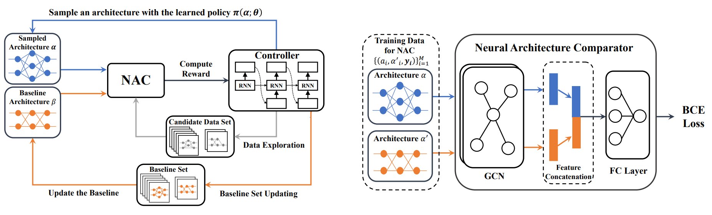

# Contrastive Neural Architecture Search with Neural Architecture Comparators

Pytorch Implementation for "Contrastive Neural Architecture Search with Neural Architecture Comparators".

<p align="center">

</p>

## Citation

If you use any part of our code in your research, please cite our paper:

```
@InProceedings{guo2020breaking,
  title = {Breaking the Curse of Space Explosion: Towards Efficient NAS with Curriculum Search},
  author = {Yaofo Chen and Yong Guo and Qi Chen and Minli Li and Yaowei Wang and Wei Zeng and Mingkui Tan},
  booktitle = {The IEEE Conference on Computer Vision and Pattern Recognition},
  year = {2021}
}
```
